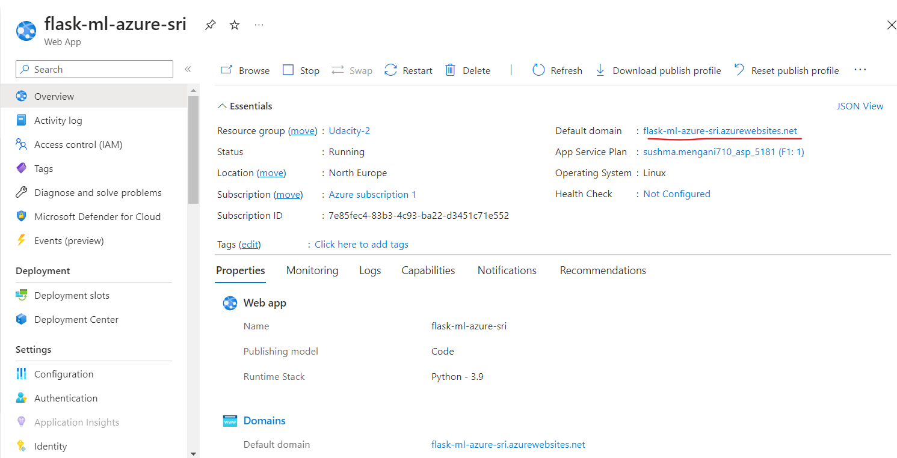
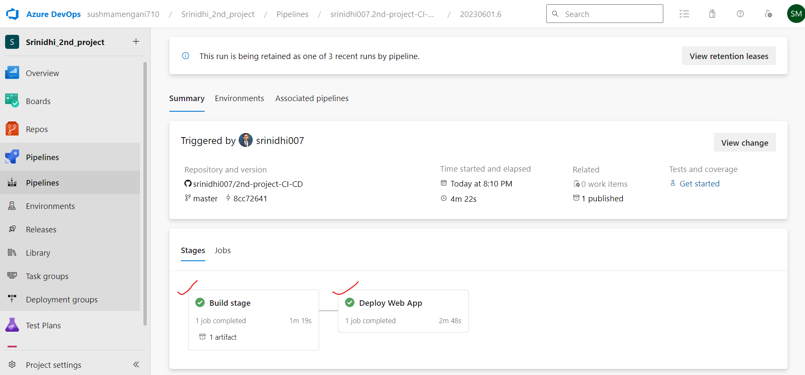

# Building a CI/CD Pipeline
In this project we will build a CI-CD pipeline by using Githun Actions, Azure app services and Azure pipelines by levaraging the Continuous integration and continous delivery strategies learnt in the course.

#

## Agile Planning and Communication
For planning and organizing the ToDo tasks, we will go through Trello for day to day tasks and use google sheets for planning weekly, quaterly and yearly outlooks.

[Trello board for day to day tasks](https://trello.com/invite/b/eV2dTCfS/ATTIb73a021f9cc41346b085b28ba7240ac05C513744/ci-cd-2nd-project)

[Google spreadsheets for high level overview and planning](https://docs.google.com/spreadsheets/d/1i13qxWZAgimTkDBM0qaHdZdUQZiCsq8p/edit?usp=sharing&ouid=106030168383046099430&rtpof=true&sd=true)


#

## Architecture Overview


## Steps 

#### clone the Repo in Azure cloud shell
- After creating github repo we have to clone it to azure cloud shell, create ssh-keys and upload them into gitHub account.


```
git clone git@github.com:srinidhi007/2nd-project-CI-CD.git
```
- It has to look something like this:


#### Install requirements and Test
- run the make file to install all the necessary packages and test it with pylint

```
make all
```
- It will look something like this:


#### Set up the web app
- we will Create an app service and initially deploy your app.
- set up virtual environment

```
cd 2nd-project-CI-CD/
python3 -m venv ~/.flask-ml-azure
source ~/.flask-ml-azure/bin/activate
```
Then run:

```
az webapp up --name flask-ml-azure-sri --resource-group Udacity-2 --sku F1 --location "North Europe" --logs --runtime "PYTHON:3.7"
```
- This is the syntax for running:
```
az webapp up -n <your-appservice-name> -l <your-region> --sku F1 -g <your-resource-group>
```

- you could see the deployed web app in Azure portal under web apps (It creates an app service plan by default if you dont specify)



- If we click on the default URL, we can go to the deployed web app inour browser:


#### Set up GitHub Actions
- The GitHub actions can be configured in pythonapp.yml in the ./workflow folder. A succesful configuration and build will look something like this:


#### Set up Azure pipelines
- setup Azure serve connection
- Create pipeline with .yml file in git. 
- After succesfully configuring the pipeline, and passing the tests, IT would look something similar to this:


- After succefully building the pipeline, you will see all the stages have finished: Builing and Deploying



- The pipeline would take some time to build, after the successful deployment, you can make the prediction by running:

```
./make_predict_azure_app.sh
```
And the output looks like this:


- Output of streamed log files from deployed application:


#### youtube Demo of the project
- Click on the link to be directed to youtube

#### https://youtu.be/bK35VK0EipY

#### Future Improvements
- To improve your existing web app deployed on Azure Pipelines with Kubernetes and microservices, consider the following steps:
  - Containerize our microservices using Docker.
  -  Deploy our containerized microservices using Kubernetes.
  -  Utilize Kubernetes' auto-scaling capabilities.
  -  Use tools like Azure Monitor, Prometheus, and Grafana to collect metrics, visualize performance, and gain insights into our application's behavior.

#
